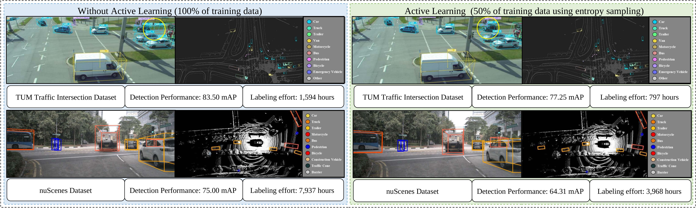
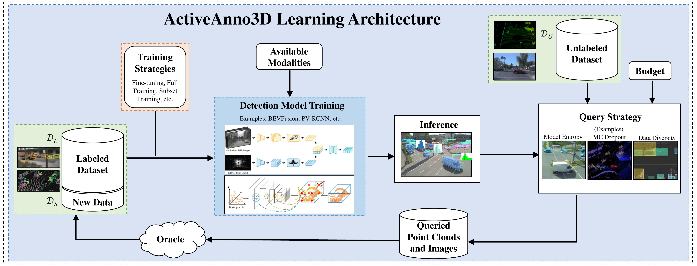
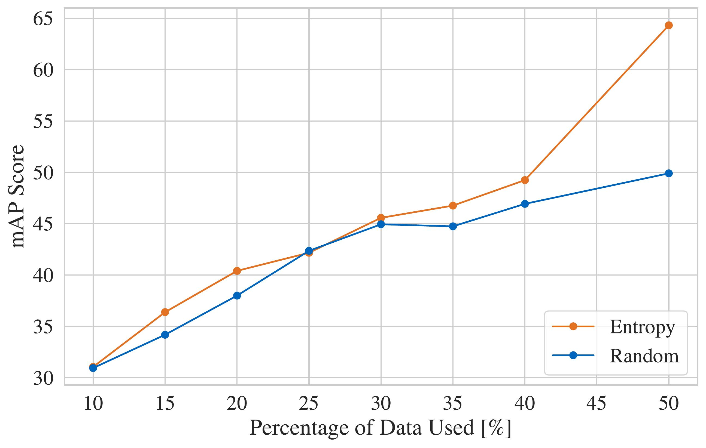
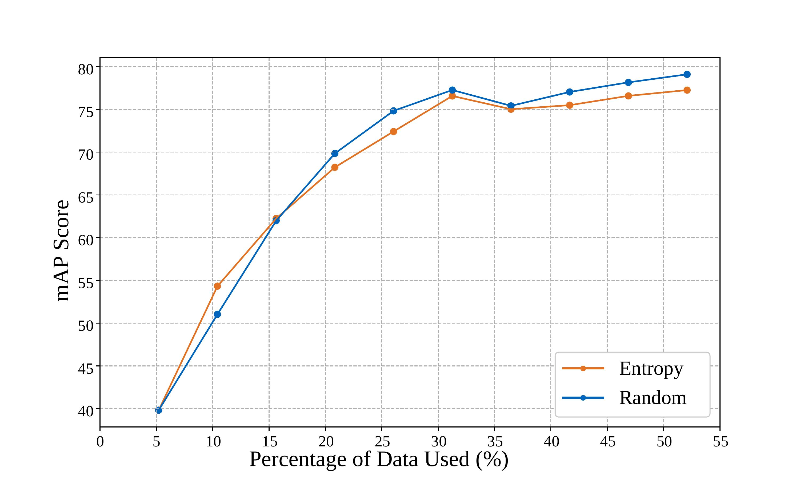
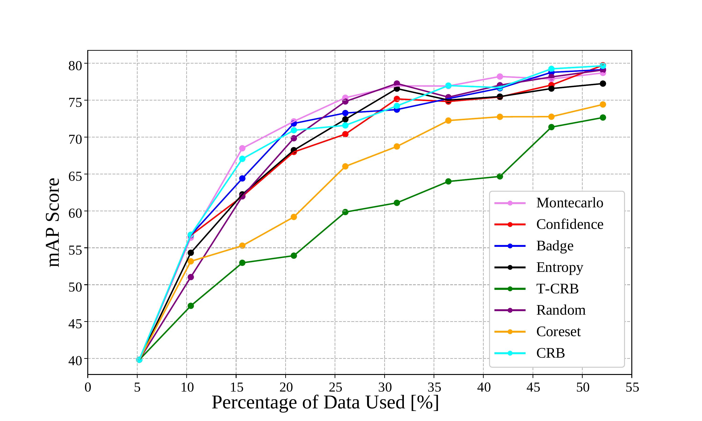
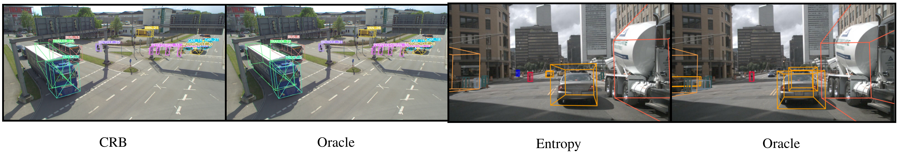

[](https://arxiv.org/pdf/2402.03235.pdf)
[](https://innovation-mobility.com/tumtraf-dataset)
[](https://active3d-framework.github.io/active3d-framework/)

# ActiveAnno3D - An Active Learning Framework for Multi-Modal 3D Object Detection


: We propose a framework for efficient active learning within various 3D object detection techniques and modalities,
demonstrating the effectiveness of active learning at reaching comparable detection performance on benchmark datasets at
a
fraction of the annotation cost. Datasets include roadside infrastructure sensors (top row) and onboard vehicle
sensors (bottom
row), with LiDAR-only and LiDAR+camera fusion methods, the two dominant strategies in state-of-the-art performance at
the safety-critical detection task.

This is the official implementation of our paper:

[IV 2024] ActiveAnno3D - An Active Learning Framework for Multi-Modal 3D Object
Detection [[arXiV]](https://arxiv.org/pdf/2402.03235.pdf) [[website]](https://active3d-framework.github.io/active3d-framework/)

## Overview

<b>ActiveAnno3D</b> is the first active learning framework for multi-modal 3D object detection. With this framework you
can select data samples for labeling that are of maximum informativeness for training.

In summary:

1. We explore various continuous training methods and integrate the most efficient method regarding computational demand
   and detection performance.
2. We perform extensive experiments and ablation studies with <b>BEVFusion</b> and <b>PV-RCNN</b> on the <b>nuScenes</b>
   and <b>TUM Traffic Intersection</b> dataset.
3. We show that we can achieve almost the same performance with <b>PV-RCNN</b> and the <i>entropy-based</i> query
   strategy when using only half of the training data (<b>77.25 mAP</b> compared to <b>83.50 mAP</b>) of the <b>TUM
   Traffic Intersection</b> dataset.
4. <b>BEVFusion</b> achieved an <b>mAP of 64.31</b> when using half of the training data and <b>75.0 mAP</b> when using
   the complete <b>nuScenes</b> dataset.
5. We integrate our active learning framework into the <b>proAnno</b> labeling tool to enable AI-assisted data selection
   and labeling and minimize the labeling costs.

## Architecture


The generalized active learning flow involves the selection of data from an unlabeled pool according to an acquisition
function, which, in the case of uncertainty-driven AL, utilizes the trained model or, in the case of diversity-driven
AL, may be independent of the training. This selected data is then annotated by an oracle and aggregated with previously
labeled data. Whether or not all data or just the new data is used in the next training step is determined by the choice
of training strategy. The variety of possible acquisition and training techniques and unique domain challenges posed by
autonomous driving make active learning an opportune environment for innovation toward safe and accurate learning.

## Installation

For installation using Docker, please refer to the [INSTALL.md](INSTALL.md) file.

The code is tested in the following python environment:

+ Python 3.7.16
+ PyTorch 1.10.1
+ CUDA 11.3.1
+ [spconv-cud113=2.21.12](https://github.com/traveller59/spconv)
+ Open3D 0.16.0
+ Wandb 0.16.2

## Our Contributions and Modifications

1. Incorporate Continuous Training Strategies
   [[link]](./pcdet/utils/active_training_utils.py/)
2. Propose Temporal CRB
   [[link]](./pcdet/query_strategies/temp_crb_sampling.py)
3. Propose Class-weighted CRB
   [[link]](./pcdet/query_strategies/weighted_crb_sampling.py)
4. Post process Predictions
   [[link]](./pcdet/models/detectors/detector3d_template.py)
5. Develop develop an interface for the proAnno labeling tool
   [[link]](./proannoV2/)

## Tutorial

The dataset, e.g. [TUM Traffic Intersection](https://innovation-mobility.com/tumtraf-dataset), has to be in the KITTI format. If it's in OpenLABEL format then use
our [converter](./pcdet/datasets/tumtraf/tumtraf_converter.py)

```
python tumtraf_converter.py --load_dir /home/user/tumtraf --save_dir /home/user/tumtraf_kitti_format --splits train val test
```

To run normal training:

in ./tools/cfgs add a folder <dataset_models> then add the .yaml configuration files for your models there.

```
python ./tools/main/train.py --cfg_file <path-to-yaml-file> --extra_tag normalTraining
```

if you want to use a pre-trained model set

```
--pretrained_model to <path-to-your-pretrained-model>
```

To run active training:

in ./tools/cfgs add a folder <active-dataset_models> then add the .yaml configuration files for your models there.

```
python ./tools/main/train.py --cfg_file <path-to-yaml-file> --extra_tag <continuous_training_method>
```

## Connection to proAnno

1. The [flask_app.py](./proannoV2/flask_app.py) file should be located anywhere outside the docker container.

2. To access this flask server from the proAnno tool running on a different machine, we should use the
   IP address of the machine where the flask app is running, followed by the port number.

   for example, if the IP address of the workstation is 192.168.1.5 and the flask server is running on port 5000, then
   from the proAnno tool on another machine we would access the flask app using 'http://192.168.1.5:5000'

3. Run [flask_app.py](./proannoV2/flask_app.py)

4. ActiveAnno3D is ready for the annotator to send a command.

5. The selected point cloud frames will be saved in ActiveAnno3D under: `./data/proannoV2/currently_annotating`, and
   they have to be copied manually to the proAnno side for annotations.

## Evaluation


The graph illustrates the mAP score achieved by the BEVFusion model on the nuScenes dataset relative to the expanding
size of the training set in the active learning setting with random and entropy queries separately.


The graph illustrates the mAP scores achieved by the PV-RCNN model on the TUM Traffic Intersection dataset relative to
the expanding size of the training set in the active learning setting with random and entropy queries separately.

The graph illustrates the mAP scores achieved by the PV-RCNN model on the TUM Traffic Intersection dataset relative to
the expanding size of the training set in the active learning setting with eight different query strategies.

## Qualitative Results


Qualitative results are illustrated by two pairs of images. The left pair is from the TUM Traffic Intersection dataset,
and the right pair is from nuScenes. For each pair, the left image shows the predicted labels for each class, with each
class represented by a different color. The right image of each pair shows the predictions made by learning on the
complete dataset. Both results are quite similar, showing the efficiency of the active learning technique.

## Benchmark Results
<center>
<table>
   <tr>
     <th colspan="2">Labeled Pool</th>
     <th colspan="2">LiDAR-Only (PV-RCNN)</th>
     <th colspan="2">LiDAR+Camera (BEVFusion)</th>
   </tr>
   <tr>
     <td>Round</td>
     <td>%</td>
     <td>Random</td>
     <td>Entropy</td>
     <td>Random</td>
     <td>Entropy</td>
   </tr>
   <tr>
        <td>1</td>
        <td>10</td>
        <td>51.03</td>
        <td>54.32 <p style="display:inline;color:red;font-size:80%;">(+3.29)</p></td>
        <td>30.95</td>
        <td>31.06 <p style="display:inline;color:forestgreen;font-size:80%;">(+0.11)</p></td>
    </tr>
    <tr>
        <td>2</td>
        <td>15</td>
        <td>61.98</td>
        <td>62.24 <p style="display:inline;color:forestgreen;font-size:80%;">(+0.26)</p></td>
        <td>34.19</td>
        <td>36.39 <p style="display:inline;color:forestgreen;font-size:80%;">(+2.20)</p></td>
    </tr>
    <tr>
        <td>3</td>
        <td>20</td>
        <td>69.84</td>
        <td>68.23 <p style="display:inline;color:red;font-size:80%;">(-1.61)</p></td>
        <td>38.00</td>
        <td>40.41 <p style="display:inline;color:forestgreen;font-size:80%;">(+2.41)</p></td>
    </tr>
    <tr>
        <td>4</td>
        <td>25</td>
        <td>74.82</td>
        <td>72.40 <p style="display:inline;color:red;font-size:80%;">(-2.42)</p></td>
        <td>42.36</td>
        <td>42.17 <p style="display:inline;color:red;font-size:80%;">(-0.19)</p></td>
    </tr>
    <tr>
        <td>5</td>
        <td>30</td>
        <td>77.25</td>
        <td><u>76.56</u> <p style="display:inline;color:red;font-size:80%;">(-0.69)</p></td>
        <td><strong>44.94</strong></td>
        <td>45.57 <p style="display:inline;color:forestgreen;font-size:80%;">(+0.63)</p></td>
    </tr>
    <tr>
        <td>6</td>
        <td>35</td>
        <td>75.40</td>
        <td>75.00 <p style="display:inline;color:red;font-size:80%;">(-0.40)</p></td>
        <td><u>44.74</u></td>
        <td>46.76 <p style="display:inline;color:forestgreen;font-size:80%;">(+2.02)</p></td>
    </tr>
    <tr>
        <td>7</td>
        <td>40</td>
        <td><u>77.03</u></td>
        <td>75.48 <p style="display:inline;color:red;font-size:80%;">(-1.55)</p></td>
        <td>-</td>
        <td><u>49.24</u></td>
    </tr>
    <tr>
        <td>8</td>
        <td>50</td>
        <td><strong>79.09</strong></td>
        <td><strong>77.25</strong> <p style="display:inline;color:red;font-size:80%;">(-1.84)</p></td>
        <td>-</td>
        <td><strong>64.31</strong></td>
    </tr>
    <tr bgcolor="lightgray">
        <td><strong>SOA (No AL)</strong></td>
        <td><strong>100</strong></td>
        <td colspan="2" style="text-align: center"><strong>83.50</strong></td>
        <td colspan="2" style="text-align: center"><strong>75.00</strong></td>
    </tr>
</table>
</center>
Evaluation of the PV-RCNN (LiDAR-only) and BEVFusion (camera+LiDAR) model using the random sampling baseline and entropy querying method on the TUM Traffic Intersection dataset and the nuScenes dataset. These Results are compaired to the respective 100% accuracies of the original work.

## Acknowledgements

Our baseline is the Active3D framework [Active3D](https://github.com/Luoyadan/CRB-active-3Ddet/tree/main), an active
learning framework for 3D object detection, proposing the CRB query strategy that assesses the point cloud data
informativeness based on 3 data characteristics: 3D box class distribution, feature representativeness, and point
density distribution.

## Citation

If you find our work useful in your research, please cite our work and ⭐ our repository.

```
@misc{activeanno3d,
      title={ActiveAnno3D - An Active Learning Framework for Multi-Modal 3D Object Detection}, 
      author={Ghita, Ahmed and Antoniussen, Bjørk and Zimmer,Walter and Greer,Ross and Creß, Christian and Møgelmose,Andreas and Trivedi, Mohan M. and Knoll,Alois C.},
      year={2024},
      eprint={2402.03235},
      archivePrefix={arXiv},
      primaryClass={cs.CV}
}
```

## License

The ActiveAnno3D framework is licensed
under [CC BY-NC-SA 4.0](https://creativecommons.org/licenses/by-nc-sa/4.0/deed.en).